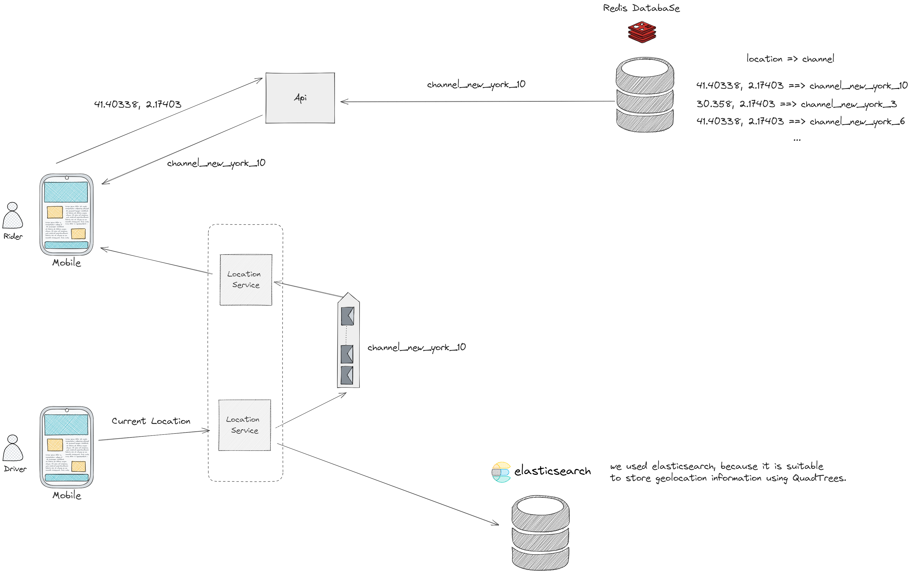

# VTC_Backend

VTC Backend

Welcome on Board everyone !!

We're going to build the Backend for a VTC (Virtual Transportation Company) app, together we will discover the different parts of this solution. To make it easier to follow and understand, I devided the work into smaller sections.

Section 1 : Preparation and Installation

- First we would create our python env : `python -m venv VTC_Backend`
- Next activate the environment we just created : `myenv\Scripts\activate`
- Next you need to install the requirements running the following command : `pip install -r requirements.txt`

